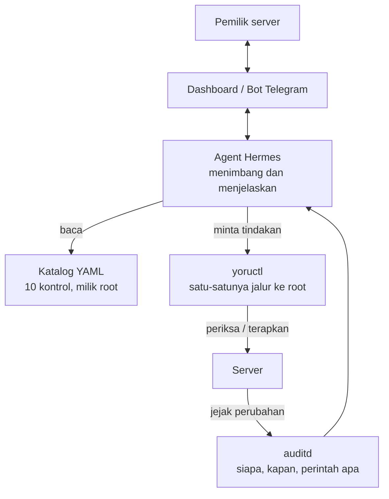

# Yoru

AI agent yang mengeraskan konfigurasi keamanan server, lalu menjaganya tetap
begitu — untuk developer dan UMKM yang tidak punya tim IT.

*Server kamu tidur. Yoru nggak.*

---

## Masalah yang dikejar

Kebanyakan server kecil dipasang sekali, lalu ditinggal. Bukan karena
pemiliknya malas, tapi karena tidak ada yang mengurus: tidak ada tim IT,
tidak ada waktu, dan istilahnya terlalu asing untuk dipelajari sambil jalan.

Yoru mengambil pekerjaan itu. Dia memeriksa setelan keamanan server, minta
izin sebelum mengubah apa pun yang berisiko, memperbaikinya, lalu tiap hari
mengecek apakah masih seperti yang disepakati.

---

## Cara kerja



Pembagian tugasnya sengaja tegas.

**Agent yang menimbang.** Kontrol mana dulu, port ini sah atau tidak, perlu
minta izin atau tidak, bagaimana menjelaskannya ke pemilik yang tidak paham
istilah teknis.

**Katalog yang menyimpan fakta.** Perintah persisnya apa, berkasnya di mana,
bagaimana cara mengembalikannya kalau gagal. Agent tidak boleh mengarang
perintah — kalau kontrolnya tidak ada di katalog, jawabannya "tidak tahu",
bukan menebak.

**`yoructl` yang bertindak.** Satu-satunya jalur agent ke hak root, dan dia
cuma menerima dua argumen: nomor kontrol dan satu dari empat tindakan. Bukan
`bash`, bukan `rm`, bukan `apt`. Kalau suatu hari agentnya salah menimbang
atau kena prompt injection dari isi log yang dia baca sendiri, batas terjauh
yang bisa dia lakukan tetap salah satu dari 40 tindakan yang sudah ditulis
dan diuji manusia.

Setiap kontrol punya empat fungsi: `periksa`, `terapkan`, `kembalikan`,
`verifikasi`. Yang terakhir itu yang paling penting — Yoru tidak pernah
menganggap sebuah kontrol berhasil hanya karena berkasnya berhasil ditulis
dan layanannya reload tanpa error. Dia membaca ulang keadaan yang
benar-benar aktif.

---

## Kontrol yang tersedia

| | Kontrol | Risiko |
|---|---|---|
| `K01` | Root tidak bisa login lewat SSH | BERISIKO |
| `K02` | Login pakai password dimatikan (SSH key saja) | BERISIKO |
| `K03` | Batasi percobaan login SSH | AMAN |
| `K04` | Buang algoritma kripto yang lemah di SSH | BERISIKO |
| `K05` | Firewall aktif, tolak semua koneksi masuk | BERISIKO |
| `K06` | Cuma port yang dipakai yang boleh terbuka | BERISIKO |
| `K07` | Pembaruan keamanan otomatis | AMAN |
| `K08` | Jejak audit aktif (auditd) | AMAN |
| `K09` | Log tersimpan permanen dan tidak membanjiri disk | AMAN |
| `K10` | Setelan kernel jaringan | AMAN |

**AMAN** berarti Yoru boleh menjalankannya sendiri. **BERISIKO** berarti dia
harus minta izin per item, dan menampilkan dulu apa yang bisa rusak sebelum
tombol setuju bisa ditekan.

Setiap kontrol dijalankan manual dan rollbacknya diuji sungguhan sebelum
masuk katalog. Bukan disalin dari checklist. Kolom `rollback_teruji` di tiap
berkas YAML itu janji, bukan hiasan.

---

## Cara pasang

### Yang perlu disiapkan

Server atau VM dengan **Ubuntu Server 24.04**, dan akun biasa yang punya
akses `sudo`. Bukan root — Yoru justru perlu tahu siapa manusia pemilik
servernya.

Sebaiknya kunci SSH kamu sudah terpasang dan sudah pernah dipakai login.
Kalau belum, pemasangan tetap jalan, cuma nanti K02 akan menolak berjalan
sampai kuncinya ada. Itu memang disengaja — K02 mematikan login password,
dan tanpa kunci yang terbukti bekerja, itu sama saja menutup satu-satunya
pintu masuk kamu sendiri.

Kalau ini VM buat coba-coba, ambil snapshot dulu. Bukan karena pemasangannya
berbahaya, tapi karena enak bisa balik ke titik nol kapan pun.

### Pasang

```bash
git clone https://github.com/Godzilla129/yoruAgent.git
cd yoruAgent
sudo bash install.sh
```

Tiga baris, tidak ada yang perlu dijawab selain password sudo.

Kalau kamu perhatikan, tidak ada cara pasang model `curl ... | sudo bash`.
Itu memang lebih ringkas, tapi ini alat keamanan — menyuruh orang
menyalurkan skrip dari internet langsung ke `sudo bash` persis kebiasaan
yang mau kami berantas. Unduh dulu, kalau mau baca dulu, baru jalankan.

### Yang akan kamu lihat

Pemasangan berjalan bertahap, tiap langkah menulis `ok`. Di bagian akhir ada
**Menguji hasil pemasangan** — di situ installer menguji kerjanya sendiri:

```
ok   agent bisa meminta tindakan yang sah
ok   agent ditolak saat mencoba perintah lain
ok   dispatcher menolak jalan saat dirinya sendiri bisa ditulis
ok   dispatcher kembali normal setelah izin dipulihkan
```

Kalau salah satu gagal, pemasangan berhenti dan menyebutkan gagal di mana.
Installer ini sengaja tidak akan bilang "selesai" sebelum terbukti jalan.

Aman dijalankan berkali-kali. Yang sudah ada dilewati, bukan dibuat ulang.

### Coba lihat hasilnya

```bash
sudo -u yoru-agent sudo -n /opt/yoru/bin/yoructl K01 periksa
```

Keluarnya satu baris JSON — itu bentuk yang dibaca dashboard dan dikirim ke
Telegram. Ganti `K01` dengan `K02` sampai `K10` untuk kontrol lain.

Coba juga yang ini:

```bash
sudo -u yoru-agent sudo -n id
```

Ditolak. Itu inti desainnya, dan lebih enak dilihat sendiri daripada
dipercaya begitu saja.

### Mana yang aman dicoba, mana yang tidak

```bash
yoructl K01 periksa       # cuma baca. aman di server mana pun
yoructl K01 terapkan      # mengubah setelan. snapshot dulu
yoructl K01 kembalikan    # mengembalikan
```

`periksa` tidak menyentuh apa pun, jadi bebas dicoba termasuk di server yang
sedang dipakai. `terapkan` mengubah setelan sungguhan — ambil snapshot dulu,
dan baca bagian `yang_rusak_kalau_diterapkan` di berkas katalognya.

> **Jangan jalankan `yoructl K05 terapkan` di server yang ada aaPanel atau
> CyberPanel.** K05 menyalakan firewall dan hanya membuka port 22, jadi panel
> di port 8888 atau 8090 langsung tidak bisa diakses. Peringatannya ada di
> `catalog/K05.yaml`, tapi dispatcher belum memaksa memeriksanya — untuk
> sekarang manusianya yang harus tahu.

### Mencopot

```bash
sudo bash install.sh --copot
```

Menghapus dispatcher, katalog, aturan sudoers, dan pengguna agent. Catatan
tindakan di `/var/log/yoru` sengaja ditinggalkan — itu jejak audit, dan alat
keamanan tidak menghapus jejaknya sendiri diam-diam.

Perlu diingat: mencopot **tidak** mengembalikan kontrol yang sudah kamu
terapkan. Kalau mau server kembali seperti semula, jalankan `kembalikan`
untuk tiap kontrol dulu, baru copot.

---

## Isi repo

```
bin/            dispatcher yoructl dan berkas aturan sudoers
catalog/        10 kontrol keamanan, satu berkas YAML per kontrol
contract/       bentuk data laporan JSON
examples/       contoh laporan, untuk membangun tanpa server
install.sh      pemasang, sekalian menguji hasilnya sendiri
check-all.sh    periksa 10 kontrol sekaligus
```

---

## Batasan saat ini

Ini masih versi awal. Yang belum ada, ditulis apa adanya:

- **Nomor CIS belum diverifikasi.** Sebagian berkas katalog menandai
  `kode_cis` sebagai `BELUM_DIVERIFIKASI`. Kontrolnya sendiri sudah diuji,
  tapi penomorannya belum dicocokkan ke dokumen CIS asli.
- **`rp_filter` sengaja tidak diterapkan.** Alasannya ada di
  `catalog/K10.yaml` — singkatnya, menulis `conf.all.rp_filter` saja tidak
  berpengaruh karena kernel memakai nilai maksimum antara `all` dan
  per-kartu, dan mode ketat bisa memutus lalu lintas yang jalurnya tidak
  simetris.
- **Dispatcher belum memaksa memeriksa keberadaan panel** sebelum menerapkan
  K05. Peringatannya sudah ada di katalog, tapi belum jadi penghalang.
- Dashboard, bot Telegram, dan kontrol untuk lapisan web sedang dikerjakan.
