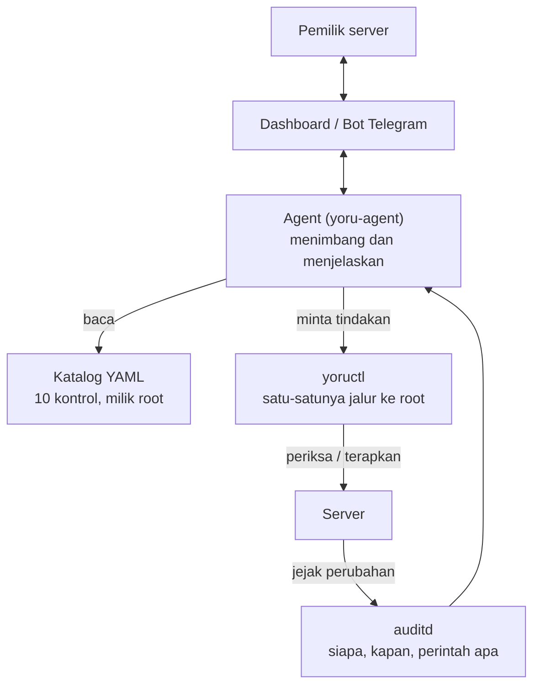
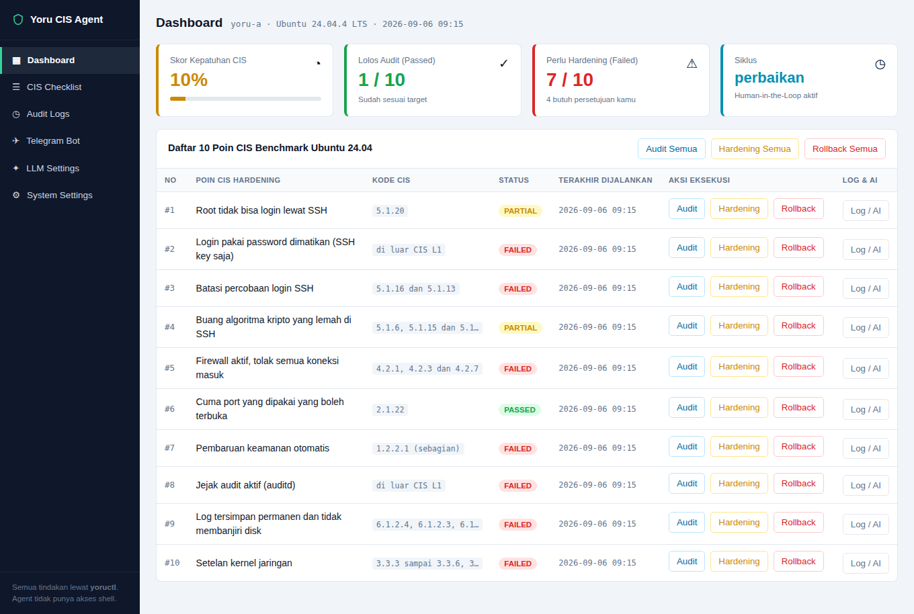
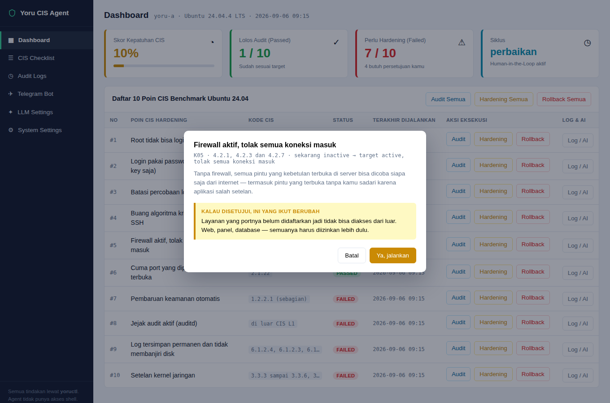

# Yoru

AI agent yang mengeraskan konfigurasi keamanan server, lalu menjaganya tetap
begitu. Dibuat untuk developer dan UMKM yang tidak punya tim IT.

*Server kamu tidur. Yoru nggak.*

---

## Masalah yang dikejar

Kebanyakan server kecil dipasang sekali, lalu ditinggal. Bukan karena
pemiliknya malas, tapi karena tidak ada yang mengurus: tidak ada tim IT,
tidak ada waktu, dan istilahnya terlalu asing untuk dipelajari sambil jalan.

Yoru mengambil pekerjaan itu. Dia memeriksa setelan keamanan server, minta
izin sebelum mengubah apa pun yang berisiko, memperbaikinya, lalu tiap hari
mengecek apakah masih seperti yang disepakati.

---

## Cara kerja


```mermaid
flowchart TD
    P["Pemilik server"] <--> UI["Dashboard / Bot Telegram"]
    UI <--> A["Agent (yoru-agent)<br/>menimbang dan menjelaskan"]
    A -- baca --> K["Katalog YAML<br/>10 kontrol, milik root"]
    A -- minta tindakan --> D["yoructl<br/>satu-satunya jalur ke root"]
    D -- periksa / terapkan --> S["Server"]
    S -- jejak perubahan --> AU["auditd<br/>siapa, kapan, perintah apa"]
    AU --> A
```

Pembagian tugasnya sengaja tegas.

**Agent yang menimbang.** Kontrol mana dulu, port ini sah atau tidak, perlu
minta izin atau tidak, bagaimana menjelaskannya ke pemilik yang tidak paham
istilah teknis.

**Katalog yang menyimpan fakta.** Perintah persisnya apa, berkasnya di mana,
bagaimana cara mengembalikannya kalau gagal. Agent tidak boleh mengarang
perintah. Kalau kontrolnya tidak ada di katalog, jawabannya "tidak tahu",
bukan menebak.

**`yoructl` yang bertindak.** Satu-satunya jalur agent ke hak root, dan dia
cuma menerima dua argumen: nomor kontrol dan satu dari empat tindakan. Bukan
`bash`, bukan `rm`, bukan `apt`. Kalau suatu hari agentnya salah menimbang
atau kena prompt injection dari isi log yang dia baca sendiri, batas terjauh
yang bisa dia lakukan tetap salah satu dari 40 tindakan yang sudah ditulis
dan diuji manusia.

Setiap kontrol punya empat fungsi: `periksa`, `terapkan`, `kembalikan`,
`verifikasi`. Yang terakhir itu yang paling penting: Yoru tidak pernah
menganggap sebuah kontrol berhasil hanya karena berkasnya berhasil ditulis
dan layanannya reload tanpa error. Dia membaca ulang keadaan yang
benar-benar aktif.

---

## Kontrol yang tersedia

| | Kontrol | Risiko | CIS Ubuntu 24.04 v1.0.0 |
|---|---|---|---|
| `K01` | Root tidak bisa login lewat SSH | BERISIKO | 5.1.20 |
| `K02` | Login pakai password dimatikan (SSH key saja) | BERISIKO | tidak ada di CIS |
| `K03` | Batasi percobaan login SSH | AMAN | 5.1.16, 5.1.13 |
| `K04` | Buang algoritma kripto yang lemah di SSH | BERISIKO | 5.1.6, 5.1.15, 5.1.12 |
| `K05` | Firewall aktif, tolak semua koneksi masuk | BERISIKO | 4.2.1, 4.2.3, 4.2.7 |
| `K06` | Cuma port yang dipakai yang boleh terbuka | BERISIKO | 2.1.22 (sebagian) |
| `K07` | Pembaruan keamanan otomatis | AMAN | 1.2.2.1 (sebagian) |
| `K08` | Jejak audit aktif (auditd) | AMAN | Level 2, bukan L1 |
| `K09` | Log tersimpan permanen dan tidak membanjiri disk | AMAN | 6.1.2.4, 6.1.2.3, 6.1.1.3, 6.1.1.1 |
| `K10` | Setelan kernel jaringan | AMAN | 3.3.3 sampai 3.3.6, 3.3.8 sampai 3.3.11 |

Nomor CIS di atas dicocokkan satu per satu ke berkas audit
`CIS_Ubuntu_Linux_24.04_LTS_v1.0.0_L1_Server` terbitan Tenable, bukan ke PDF
CIS aslinya. Karena itu kami tidak menyebut Yoru "sesuai CIS".

Tiga baris yang tidak berisi nomor juga sengaja ditulis apa adanya. **K02
tidak ada padanannya di CIS**: seluruh bagian SSH sudah diperiksa dan tidak
ada satu pun rekomendasi tentang mematikan login password. Itu pilihan kami,
karena sasaran Yoru satu server milik satu orang, bukan armada perusahaan
yang belum tentu bisa pakai kunci SSH di semua mesin. **K08 ada di CIS Level
2**, bukan Level 1, jadi di paket dasar ini K08 itu tambahan. Yang bertanda
*sebagian* memang belum menutup seluruh isi item CIS-nya.

**AMAN** berarti Yoru boleh menjalankannya sendiri. **BERISIKO** berarti dia
harus minta izin per item, dan menampilkan dulu apa yang bisa rusak sebelum
tombol setuju bisa ditekan.

Setiap kontrol dijalankan manual dan rollbacknya diuji sungguhan sebelum
masuk katalog. Kolom `rollback_teruji` di tiap berkas YAML mencatat hasil uji
itu.

Setelah itu semuanya diuji sekali lagi lewat `yoructl`. Sepuluh kontrol
dikali empat fungsi berarti 40 tindakan, dan keempat puluhnya sudah pernah
benar-benar dijalankan lewat jalur yang dipakai agent. Dari situ ketemu empat
bug yang tidak akan pernah muncul kalau kami cuma menjalankan `periksa`.
Salah satunya bikin K02 tidak pernah bisa diterapkan sama sekali, dan cara
gagalnya berupa penolakan yang terdengar masuk akal. Kerusakan seperti itu
yang paling susah dicurigai. Ceritanya lengkap ada di `catalog/K02.yaml`.

---

## Dashboard



Sepuluh kontrol dalam satu tabel: kode CIS-nya, statusnya, nilai yang
terbaca, dan empat tombol: Audit, Hardening, Rollback, dan Log. Tiga yang
pertama memanggil `yoructl`, program yang sama yang dipakai agent. Tidak ada
jalur lain ke hak root. Log cuma membuka catatan tindakan untuk kontrol itu.

Untuk kontrol yang berisiko, tombol Hardening **tidak langsung jalan**. Dia
menampilkan dulu apa yang bakal ikut berubah:



Orang yang menekan tombol harus sudah membaca akibatnya. Itu aturan yang tidak
bisa ditawar, dan alasannya ada di `contract/report.md`.

Di atas tabel itu ada dua panel yang cuma muncul kalau memang ada isinya.

**Yang berubah sejak pemeriksaan terakhir.** Inti Siklus Penjagaan: kontrol
yang dulu lulus dan sekarang tidak. Ditampilkan berikut nilai lamanya, nilai
barunya, dan kalau auditd (K08) aktif, juga siapa yang mengubahnya, kapan,
dan lewat perintah apa. Kalau auditd mati, yang tertulis adalah bahwa memang tidak
ada catatannya. Yoru tidak menebak nama orang.

**Butuh jawaban kamu.** Dua hal berkumpul di sini. Pertama, port yang
terbuka ke internet dan belum kamu jawab. K05 menolak menyalakan firewall
selama masih ada yang menggantung, jadi tiap port ditampilkan berikut nama
prosesnya dengan satu tombol "Punya saya". Kedua, kontrol berisiko yang
menunggu persetujuan.

Jawaban di dua panel itu **tidak dijalankan halaman ini**. Dia menuliskannya,
lalu agent di server yang bersangkutan yang mengambil dan mengerjakannya pada
siklus berikutnya. Karena itu dua panel ini bekerja untuk server mana pun yang
pernah mengirim laporan ke sini, bukan cuma mesin tempat dashboard dipasang.

Kalau ada lebih dari satu server, pemilih server muncul di kanan atas. Kalau
yang dipilih mesin ini sendiri, di sebelahnya muncul tanda **MESIN INI**.
Untuk server lain tombol Audit, Hardening dan Rollback dimatikan. Ketiganya
menjalankan `yoructl` di mesin tempat dashboard dipasang, jadi kalau ditekan
untuk server lain, yang dikeraskan malah server yang salah.

Selain halaman utama, cuma ada dua halaman lagi.

**Riwayat** menggambar skor dari laporan-laporan terakhir, jadi kelihatan
apakah server ini membaik atau pelan-pelan mundur. Di bawahnya ada catatan
tindakan dari `/var/log/yoru/`, jejak milik root yang tidak bisa disunting
agent.

**Setelan** mengatur bot Telegram, model AI, dan setelan sistem seperti port
yang boleh terbuka dan jam pemindaian harian. Semuanya tersimpan di
`/etc/yoru/yoru.conf`, jadi pemilik server tidak perlu buka terminal lagi
setelah pemasangan. Halamannya sendiri tidak punya izin menulis berkas itu.
Dia menitipkannya ke `yoructl konfigurasi`, dengan daftar kunci tertutup dan
setiap nilai diperiksa bentuknya. `DASHBOARD_TOKEN` sengaja tidak ada di
daftar itu: kalau dashboard boleh mengganti tokennya sendiri, dashboard yang
jebol bisa mengunci pemiliknya di luar.

### Mencoba tanpa server

```bash
cd web
python3 -m pip install fastapi uvicorn
python3 demo.py
```

Buka `http://127.0.0.1:8000`. Datanya dari `examples/`, tidak ada mesin yang
disentuh. Di Linux dan macOS, `bash demo.sh` sama saja.

Isinya dua server: `yoru-a` yang sehat tapi ada satu setelan berubah, dan
`yoru-b` yang sakit dengan dua port belum dijawab. Jadi panel drift, panel
port, dan pemilih server langsung ada isinya.

Siapa yang boleh menjangkau endpoint mana diperiksa, bukan diyakini:

```bash
cd web
python3 test_api.py
```

Aplikasinya dijalankan langsung sebagai ASGI dengan alamat pemanggil disetel
tangan, jadi "dari 127.0.0.1" dan "dari jaringan" dua-duanya bisa diuji. Itu
perlu karena aturannya memang beda di dua tempat itu.

---

## Cara pasang

### Yang perlu disiapkan

Server atau VM dengan **Ubuntu Server 24.04**, dan akun biasa yang punya
akses `sudo`. Jangan pakai root, soalnya Yoru justru perlu tahu siapa
manusia pemilik servernya.

Sebaiknya kunci SSH kamu sudah terpasang dan sudah pernah dipakai login.
Kalau belum, pemasangan tetap jalan, cuma nanti K02 akan menolak berjalan
sampai kuncinya ada. Itu memang disengaja. K02 mematikan login password,
dan tanpa kunci yang terbukti bekerja, itu sama saja menutup satu-satunya
pintu masuk kamu sendiri.

Kalau kuncinya belum ada, installer akan menawarkan untuk **menerima
tempelan kunci publik** kamu, memeriksanya pakai `ssh-keygen`, lalu
menuliskannya dengan izin yang benar. Kunci yang kepotong satu huruf ditolak
di situ juga, bukan nanti pas kamu sudah tidak bisa masuk.

Yang tidak akan dia lakukan: **membuatkan kunci privat**. Kunci privat yang
dibuat di server berarti kunci privat yang pernah ada di server, dan untuk
sampai ke laptop pemiliknya dia harus lewat terminal atau salinan berkas.
Itu persis kebiasaan yang bikin server orang jebol duluan. Kunci privat lahir di
mesin pemiliknya. Salah tempel kunci privat ke pertanyaan itu pun dihentikan,
dan kamu diberitahu bahwa kunci itu sudah tidak bisa dianggap rahasia lagi.

Kalau ini VM buat coba-coba, ambil snapshot dulu. Bukan karena pemasangannya
berbahaya, tapi karena enak bisa balik ke titik nol kapan pun.

### Pasang

```bash
git clone https://github.com/Godzilla129/yoruAgent.git
cd yoruAgent
sudo bash install.sh --check-only
sudo bash install.sh
```

Perintah pertama cuma membaca server, tidak mengubah apa pun. Dia memeriksa
versi Ubuntu, systemd, apt, ruang disk, port dashboard, dan setelan SSH, lalu
bilang apa yang kurang sebelum ada satu berkas pun yang ditulis. Kalau
hasilnya siap, baru jalankan perintah kedua.

Perintah kedua memasang semuanya: dispatcher, katalog sepuluh kontrol,
agent, siklus penjagaan harian, dan dashboard. Selesai memasang, dashboard
sudah jalan di `http://127.0.0.1:8000` dan sudah ada isinya, karena servernya
diperiksa sekali di akhir pemasangan tanpa mengubah satu setelan pun.

#### Yang ditanyakan

Semua pertanyaan muncul di awal, sebelum ada yang dipasang. Kalau terminalnya
mendukung, pertanyaannya muncul sebagai kotak dialog.

1. **Kunci SSH publik**, kalau akun pemilik belum punya. Penjelasannya ada di
   bagian sebelum ini.
2. **Token bot Telegram.** Boleh dilewati dan diisi belakangan di halaman
   Setelan.
3. **Model AI.** Pilihannya Hermes Agent (dipasang di server ini, kamu isi
   kunci API Gemini, OpenRouter, atau penyedia lain yang formatnya OpenAI),
   Google Gemini lewat penghubung kecil, alamat lain yang memakai format
   OpenAI (misalnya Ollama), atau dilewati. Hermes pilihan bawaannya: tekan
   Enter dan Hermes ikut dipasang di pemasangan yang sama. Kalau kuncinya
   dari Google, installer menanyakan ke Google model apa saja yang boleh
   dipakai kunci itu, lalu menyarankan model Lite yang paling murah. Tiap
   model dicoba dengan satu pesan pendek, dan yang sedang bisa menjawab
   ditaruh paling atas. Model lainnya jadi cadangan: kalau pesan ditolak
   Google karena penuh atau kuotanya habis, Hermes pindah ke cadangan untuk
   pesan itu. Nama model lain boleh diketik sendiri, asal ada di daftar dari
   Google. Tanpa model, Yoru tetap jalan dan kalimat penjelasannya diambil
   dari katalog.

Kalau pakai kotak dialog, sesudahnya muncul ringkasan, dan pemasangan baru
mulai kalau kamu setuju. Dari situ sampai selesai tidak ada pertanyaan lagi.
Yang sudah diisi di pemasangan sebelumnya tidak ditanya ulang.

Kunci Gemini tidak ditulis ke `/etc/yoru/yoru.conf`. Kuncinya disimpan di
`/etc/yoru/model.env` dan dipakai oleh penghubung kecil yang berjalan sebagai
pengguna tersendiri. Agent tidak bisa membaca berkas itu, dan installer
membuktikannya dulu sebelum lanjut. Alasannya sederhana: `yoru.conf` bisa
dibaca agent, jadi kunci yang bisa dipakai belanja tidak boleh ada di situ.

Hermes Agent diperlakukan sama. Dia jalan sebagai pengguna `yoru-hermes`, dan
kunci API-nya ada di `/var/lib/yoru-hermes/.hermes/.env` yang cuma bisa
dibuka pengguna itu. Yoru cuma memegang token layanan untuk bicara ke Hermes
di `127.0.0.1`. Semua tool Hermes (terminal, berkas, kode, browser) dimatikan
untuk jalur itu, jadi Hermes cuma bisa merangkai kalimat. Yang bisa mengubah
server tetap cuma `yoructl`. Mau ganti kunci, penyedia, atau model, atau
menambah Hermes ke server yang sudah terpasang:

```bash
sudo bash install.sh --hermes
```

Yang rahasia, seperti token Telegram dan kunci API, diketik tanpa tampil di
layar dan tidak pernah lewat argumen perintah. Argumen kelihatan oleh siapa
pun yang sedang login, dan tersimpan di riwayat shell.

#### Menyambungkan Telegram

Kalau kamu mengisi token bot, installer menutup dengan satu kode pendek.
Kodenya beda-beda tiap server, bentuknya kira-kira begini:

```
  Connect Telegram - open your bot and send this, once:
      /start K7M2QP
```

Kirim baris itu ke bot kamu, cukup sekali. Kode ini perlu karena nama bot di
Telegram bisa dicari siapa saja. Tanpa kode, orang asing yang menemukan bot
kamu duluan bisa jadi pemegang tombol setuju untuk server kamu. Kalau layar
installernya sudah terlewat, kodenya juga ada di halaman Setelan.

Sesudah tersambung, bot bisa diajak ngobrol pakai kalimat biasa, misalnya
"kenapa skornya turun?". Kalimat itu dijawab model AI (Hermes kalau
dipasang) dengan bekal laporan terakhir. `/status` dan tombol Setuju tetap
diambil langsung dari laporan, bukan dari model. Kalau belum ada model,
atau modelnya sedang mati, bot bilang begitu dan tetap melayani `/status`
dan `/help`.

#### Membuka dashboard dari laptop

Dashboard cuma mendengar di `127.0.0.1`. Cara paling aman membukanya dari
laptop adalah terowongan SSH. Perintahnya juga dicetak installer di akhir:

```bash
ssh -L 8000:127.0.0.1:8000 pemilik@alamat-server
```

Tambahkan `-p <port>` kalau SSH-nya tidak di port 22. Selama terminal itu
terbuka, buka `http://127.0.0.1:8000` di browser laptop. Tidak ada port baru
yang terbuka ke internet.

Kalau memang harus dibuka langsung ke jaringan:

```bash
sudo bash install.sh --host 0.0.0.0 --port 8080
```

Begitu dibuka ke jaringan, tombol Hardening di halaman itu jadi tombol yang
bisa ditekan siapa saja yang bisa menjangkau portnya. Jadi installer
membuatkan token, mencetaknya di akhir, dan dashboard akan memintanya sekali
di browser. Dari `127.0.0.1` token tidak pernah diminta, karena yang sudah
bisa membuka `127.0.0.1` memang sudah punya akses ke server itu.

Tokennya dipakai untuk membaca juga, tidak cuma untuk menekan tombol. Laporan
menyebut kontrol mana yang gagal, kernelnya apa, dan port apa saja yang
terbuka berikut nama prosesnya. Kalau dibagikan tanpa ditanya, itu jadi
laporan pengintaian gratis atas mesin yang titik lemahnya sudah didaftar.
Halaman Riwayat lebih jauh lagi: catatan tindakannya itu jejak milik root
yang justru dibuat supaya agent tidak bisa menyuntingnya. Dua-duanya sekarang
ada di balik aturan yang sama dengan tombol Hardening.

#### Pilihan lain

```bash
sudo bash install.sh --owner budi      # akun pemilik, kalau bukan yang sedang memakai sudo
sudo bash install.sh --no-dashboard    # tanpa dashboard
sudo bash install.sh --no-questions    # tanpa pertanyaan, untuk skrip otomatis
```

Tanpa dashboard berarti tanpa tombol di Telegram juga, karena yang
mendengarkan tombol itu ada di dalam dashboard. Dengan `--no-questions`,
installer tidak menanyakan apa pun, lalu di akhir menyebut apa saja yang
masih kosong, misalnya token Telegram atau model AI.

Flag lama yang berbahasa Indonesia (`--pemilik`, `--tanpa-dashboard`,
`--tanpa-tanya`, `--periksa-saja`, `--copot`) masih diterima, jadi skrip lama
tidak rusak.

Kalau kamu perhatikan, tidak ada cara pasang model `curl ... | sudo bash`.
Itu memang lebih ringkas, tapi ini alat keamanan. Menyuruh orang menyalurkan
skrip dari internet langsung ke `sudo bash` persis kebiasaan yang mau kami
berantas. Unduh dulu, baca kalau mau, baru jalankan.

### Yang akan kamu lihat

Pemasangannya dibagi lima bagian: memeriksa server, pertanyaan, memasang,
menguji, lalu ringkasan. Tiap baris diawali satu penanda: `ok`, `!` untuk
peringatan, `x` untuk yang menghentikan, dan `..` untuk yang sedang jalan.
Keluaran apt dan pip tidak ditampilkan di layar, tapi disimpan lengkap di
`/var/log/yoru-install.log`.

Di bagian **Verifying**, installer menguji kerjanya sendiri:

```
Verifying
  ok  the agent can run an allowed action
  ok  the agent is blocked from anything else
  ok  the dispatcher refuses to run while it is writable
  ok  the watch refuses to run as root
  ok  the daily timer is registered with systemd
```

Ada satu uji lagi yang tidak mencetak baris sendiri: setelah uji ketiga,
dispatcher harus kembali normal begitu izinnya dipulihkan. Kalau salah satu
gagal, pemasangan berhenti dan menyebut gagal di mana. Installer ini sengaja
tidak akan bilang selesai sebelum terbukti jalan.

Di ringkasan akhir ada daftar **Still open**, isinya hal yang belum beres dan
perlu kamu kerjakan sendiri. Contohnya menguji kunci SSH dari terminal lain
sebelum menyetujui K02.

Aman dijalankan berkali-kali. Yang sudah ada dilewati, bukan dibuat ulang.

### Coba lihat hasilnya

```bash
sudo -u yoru-agent sudo -n /opt/yoru/bin/yoructl K01 periksa
```

Keluarnya satu baris JSON. Itu bentuk yang dibaca dashboard dan dikirim ke
Telegram. Ganti `K01` dengan `K02` sampai `K10` untuk kontrol lain.

Coba juga yang ini:

```bash
sudo -u yoru-agent sudo -n id
```

Ditolak. Itu inti desainnya, dan lebih enak dilihat sendiri daripada
dipercaya begitu saja.

### Mana yang aman dicoba, mana yang tidak

```bash
yoructl K01 periksa       # cuma baca. aman di server mana pun
yoructl K01 terapkan      # mengubah setelan. snapshot dulu
yoructl K01 kembalikan    # mengembalikan
```

`periksa` tidak menyentuh apa pun, jadi bebas dicoba termasuk di server yang
sedang dipakai. `terapkan` mengubah setelan sungguhan, jadi ambil snapshot dulu,
dan baca bagian `yang_rusak_kalau_diterapkan` di berkas katalognya.

> **K05 menolak menyala selama masih ada port terbuka yang belum kamu jawab.**
> Port SSH dicarinya sendiri dari `sshd -T`, jadi server yang SSH-nya bukan di
> 22 tetap aman. Untuk layanan lain (web, panel, apa pun), Yoru berhenti dan
> menyebutkan port berikut nama prosesnya, lalu menunggu jawabanmu. Daftarkan
> lewat halaman Setelan di dashboard, atau isi `PORT_DIIZINKAN` di
> `/etc/yoru/yoru.conf`. Yoru tidak pernah menebak port mana yang boleh
> terbuka.

### Mencopot

```bash
sudo bash install.sh --uninstall
```

Menghapus dispatcher, katalog, dashboard, penghubung model beserta kuncinya,
aturan sudoers, dan pengguna agent. Empat folder sengaja ditinggalkan:
catatan tindakan di `/var/log/yoru`, konfigurasi di `/etc/yoru`, laporan di
`/var/lib/yoru`, dan rekaman keadaan asal di `/var/backups/yoru`. Itu jejak
audit dan data milik kamu, dan alat keamanan tidak boleh menghapus jejaknya
sendiri diam-diam. Kalau servernya mau dijual atau dikembalikan ke penyedia,
hapus sendiri `/etc/yoru/yoru.conf`, karena token bot masih ada di situ.

Perlu diingat: mencopot **tidak** mengembalikan kontrol yang sudah kamu
terapkan. Kalau mau server kembali seperti semula, jalankan `kembalikan`
untuk tiap kontrol dulu, baru copot.

---

## Isi repo

```
bin/yoructl           satu-satunya pintu ke hak root - 10 kontrol x 4 tindakan
bin/yoru-agent        otaknya: memeriksa, merakit laporan, menerapkan yang disetujui
bin/yoru-watch        pembungkus yang dipanggil timer harian
bin/yoru-model-proxy  penghubung ke Gemini, satu-satunya yang memegang kunci API
catalog/              10 kontrol keamanan, satu berkas YAML per kontrol
contract/             bentuk data laporan JSON, dipakai dispatcher sampai dashboard
web/                  API dashboard dan halamannya
systemd/              unit systemd: siklus penjagaan harian dan dashboard
examples/             contoh laporan dan contoh konfigurasi
docs/                 penjelasan alur, peta kode, dan panduan pasang di VPS
install.sh            pemasang semuanya, sekalian menguji hasilnya sendiri
check-all.sh          periksa 10 kontrol sekaligus, tanpa memasang apa pun
demo.sh               nyalakan dashboard dengan data contoh
```

Setelah terpasang, berkas-berkasnya duduk di sini:

```
/opt/yoru/bin/              dispatcher dan pembungkus, milik root
/usr/share/yoru/catalog/    katalog, milik root - agent cuma boleh membaca
/etc/yoru/yoru.conf         konfigurasi, root:yoru-agent 640
/etc/yoru/model.env         kunci model AI, root:yoru-model 640 - agent tidak bisa membaca
/var/lib/yoru-hermes/       Hermes Agent dan kunci API-nya, milik yoru-hermes 700
/var/log/yoru/tindakan.log  catatan tindakan, milik root - agent TIDAK bisa menulis
/var/lib/yoru/              laporan dan database dashboard, milik yoru-agent
/opt/yoru/web/              dashboard dan venv-nya, milik root - agent cuma menjalankan
/var/log/yoru-install.log   catatan lengkap pemasangan, termasuk keluaran apt dan pip
```

Pembagian izin itu inti desainnya: agent boleh menulis laporannya sendiri,
tapi tidak boleh menyentuh katalog yang jadi acuannya, dan tidak boleh
menyunting catatan tindakannya sendiri.

---

## Catatan untuk yang membaca kodenya

Bahasanya memang masih campur. Nama fungsi, variabel, dan komentar di kode
pakai bahasa Inggris, begitu juga kolom SQLite dan sebagian besar field di
laporan JSON. Yang masih bahasa Indonesia:

- Empat nama tindakan: `periksa`, `terapkan`, `kembalikan`, `verifikasi`.
- Kata status: `LULUS`, `GAGAL`, `DILEWATI`, `DITOLAK`, `DIKEMBALIKAN`,
  `DISIMPAN`.
- Keputusan pemilik: `setuju`, `tolak`, `sah`, `kembalikan`.
- Lima field di hasil tindakan pada laporan JSON: `nilai_sesudah`,
  `diverifikasi`, `dirollback`, `pesan_error`, `durasi_detik`.
- Kunci YAML di katalog, misalnya `nama`, `kenapa`, `risiko`.
- Sebagian kunci di `/etc/yoru/yoru.conf`: `NAMA_SERVER`, `JAM_PENJAGAAN`,
  `ZONA_WAKTU`, `LEWATI_KONTROL`, `PORT_DIIZINKAN`.
- Pilihan baris perintah `yoru-agent` (`--siklus`, `--kering`, dan
  lainnya), serta `konfigurasi` dan `--paksa` di `yoructl`.
- Beberapa nama file: `/etc/yoru/pemilik`, `/var/log/yoru/tindakan.log`,
  `/var/lib/yoru/laporan-terakhir.json`, `/var/lib/yoru/port-disetujui`,
  dan isi `/var/backups/yoru/` (`tercatat`, `keadaan.json`, `berkas/`).
- Komentar di `examples/yoru.conf.example`, unit systemd, aturan sudoers,
  dan `.gitattributes`.
- Semua kalimat yang dibaca pemilik server, kecuali keluaran installer dan
  penghubung Gemini, yang bahasa Inggris.

Nama tindakan, kata status, dan field JSON dipakai bareng oleh `yoructl`,
agent, dan dashboard, dan bentuknya tertulis di `contract/report.md`. Kalau
nanti mau diganti, harus diganti di semua tempat itu sekaligus.

---

## Batasan saat ini

Ini masih versi awal. Yang belum ada, ditulis apa adanya:

- **Nomor CIS dicocokkan dari sumber sekunder.** Rujukannya berkas audit
  Tenable untuk CIS Ubuntu 24.04 v1.0.0 L1 Server, bukan PDF CIS aslinya.
  Nomor dan judulnya sama, tapi kami tidak memegang dokumen primernya, dan
  itu ditulis di setiap berkas katalog. Bagian auditd juga belum dicocokkan
  sama sekali karena ada di profil Level 2, dan berkas itu belum kami buka.
- **Satu setelan CIS terlewat di K10: `3.3.2 packet redirect sending`.**
  Yang sudah ditangani cuma `accept_redirects` (server ini *menerima*
  redirect); `send_redirects` (server ini *mengirim* redirect) belum. Baru
  ketahuan waktu penomoran dicocokkan, sehari sebelum deploy, jadi kami
  memilih menuliskannya daripada menambal semalam. Rinciannya di
  `catalog/K10.yaml`.
- **`rp_filter` sengaja tidak diterapkan.** Alasannya ada di
  `catalog/K10.yaml`. Singkatnya, menulis `conf.all.rp_filter` saja tidak
  berpengaruh karena kernel memakai nilai maksimum antara `all` dan
  per-kartu, dan mode ketat bisa memutus lalu lintas yang jalurnya tidak
  simetris.
- **Model baru dipakai di dua tempat.** Lewat alamat di `HERMES_URL`, model
  dipakai untuk menilai port terbuka yang belum dijawab pemilik, dan untuk
  menjawab kalimat biasa di bot Telegram. Sisa kalimat di laporan masih
  diambil apa adanya dari katalog. Itu disengaja untuk sekarang: laporan
  tidak boleh gagal keluar cuma karena satu panggilan API, jadi tiap
  tambahan harus punya jalan mundur yang jelas dulu.
- **Obrolan bot lewat Hermes baru diuji dengan Telegram tiruan.** `/status`
  dan tombolnya sudah dicoba dengan bot asli di VM uji (28 Sep 2026).
  Jawaban kalimat biasa diuji dengan Hermes Agent sungguhan di atas model
  tiruan, belum dengan penyedia berbayar.
- **Jawaban di panel drift belum dikerjakan dengan benar.** "Ini memang
  saya" baru disimpan, belum dijadikan patokan baru, jadi kontrolnya tetap
  tercatat GAGAL. "Kembalikan" menjalankan `yoructl kembalikan`, yang
  membatalkan setelan Yoru, padahal maksud tombolnya memasang lagi setelan
  yang aman.
- **`kembalikan` pada K05 mengosongkan firewall, bukan memulihkannya.**
  Perintahnya `ufw reset`, jadi aturan yang dipasang sendiri oleh pemilik
  server ikut terhapus. ufw mengarsipkan berkasnya lebih dulu ke
  `/etc/ufw/user.rules.<tanggal>`, jadi datanya tidak hilang. Tapi Yoru
  belum memulihkan dari arsip itu. Untuk kontrol ini, "kembalikan" lebih
  tepat dibaca "dikosongkan".
- **K02 mengabaikan AllowGroups dan DenyGroups.** Semua akun yang masih bisa
  masuk lewat SSH sudah diperiksa satu per satu, termasuk yang bukan pemilik.
  Yang belum dibaca cuma pembatasan berbasis grup. Keduanya hanya
  *mempersempit* siapa yang boleh masuk, jadi mengabaikannya bisa bikin
  daftar peringatan kepanjangan, tapi tidak pernah kependekan.
- **Pagu log K09 masih dipatok 500M.** Katalognya sendiri bilang angka itu
  harus dihitung ulang per server. Masuk akal untuk disk 10 sampai 100 GB, tidak
  untuk di luar itu.
- Kontrol untuk lapisan web (nginx, TLS, header) belum ada. Sepuluh kontrol
  yang sekarang semuanya di lapisan sistem operasi.
